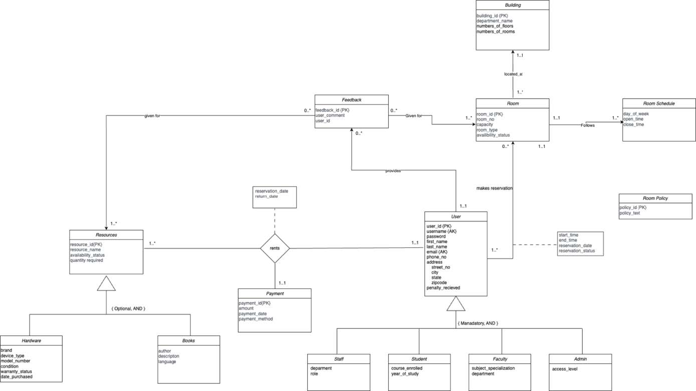
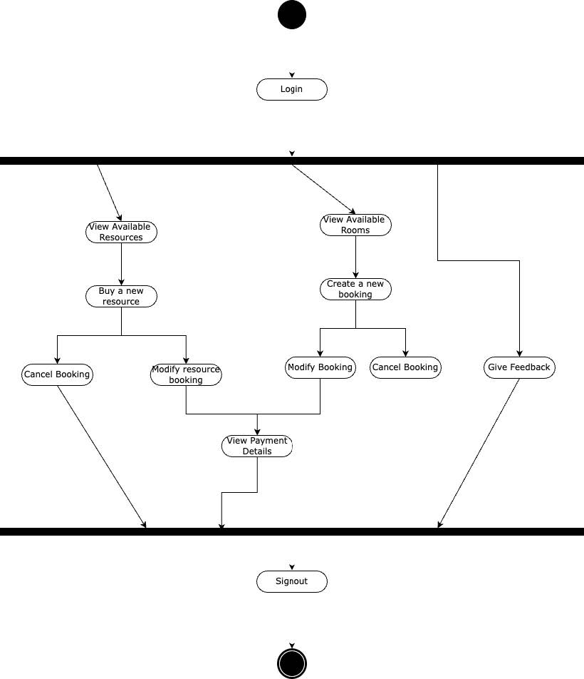
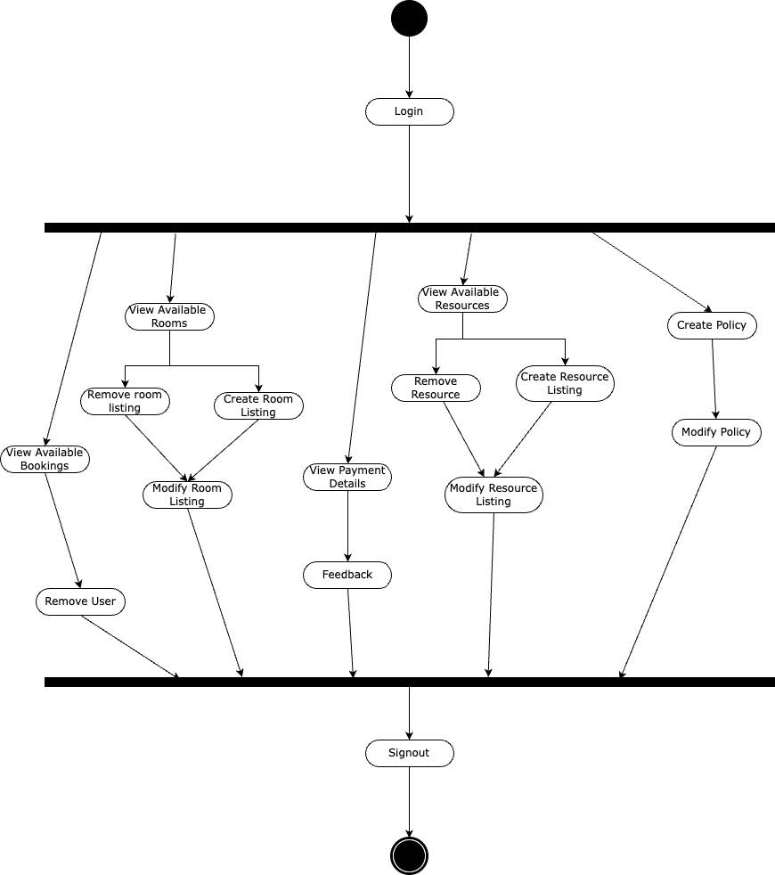

# University Booking & Renting Portal

A full-stack web application for managing university room bookings, resource rentals, and payments. Built with **React**, **Django**, and **MySQL**.

## Tech Stack

- **Frontend:** React 17.0.1
- **Backend:** Django 5.1.3 (Python 3.10.1)
- **Database:** MySQL 8.0
- **Data Pipeline:** Python (BeautifulSoup for web scraping book data)

## Features

- **Room Booking:** Browse available rooms, create/modify/cancel reservations
- **Resource Renting:** Rent books and hardware (laptops, devices), manage returns
- **Admin Dashboard:** Manage rooms, resources, users, policies, and payments
- **Feedback System:** Users can submit feedback for rooms and resources
- **Payment Tracking:** View payment details and penalty management
- **Web Scraping:** Automated book data ingestion from Brookline Booksmith's top 100 list

## Database Schema

### Logical Design

The database follows **Third Normal Form (3NF)**.


### ERD Diagram




### Entity Relationships

- A **Building** contains multiple **Rooms** (1:N)
- Each **Room** follows a **Room Schedule** (1:1) and a **Room Policy**
- **Users** can book multiple **Rooms** (M:N via room_user)
- **Users** can rent multiple **Resources** (M:N via rents)
- Each **Rent** is linked to a **Payment** (1:1)
- **Feedback** can be associated with **Rooms** or **Resources**
- **Users** are specialized into **Staff**, **Student**, **Faculty**, and **Admin** roles

## Activity Diagrams

### User Flow



### Admin Flow



## Getting Started

### Prerequisites

- Python 3.10+
- Node.js and npm
- MySQL 8.0

### Database Setup

Import the database dump file:
```bash
mysql -u root -p < DatabaseDump.sql
```

### Web Scraping (Optional)

1. Open `DBMS_Book_Webscrapping.ipynb` in Jupyter Notebook
2. Install dependencies:
```bash
pip install mysql-connector-python beautifulsoup4 requests regex
```
3. Update the database config in the notebook with your MySQL credentials
4. Run the cells to populate book data

### Backend (Django)

```bash
cd dbmsBackend
pip install django mysql django-cors-headers
# Update DATABASES config in settings.py with your MySQL credentials
python manage.py migrate
python manage.py makemigrations
python manage.py runserver
```

### Frontend (React)

```bash
cd libraryfrontend
npm install
npm start
```

The app will be running at `http://localhost:3000` with the backend at `http://localhost:8000`.

## Team

- **Dhyan Patel**
- **Vidit Gandhi**
- **Aryan Mehta**